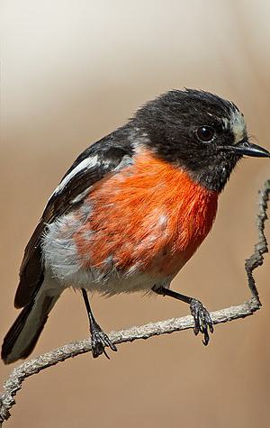

# 🧵 Seam Carving for Content-Aware Image Resizing  
**Application of Graph Theory in Image Processing**

---

## 📌 Overview

Traditional image resizing techniques (uniform scaling or cropping) treat all pixels equally.  
This often leads to distortion of important visual content such as people, animals, or buildings.

**Seam Carving** is a content-aware image resizing algorithm introduced by  
**Avidan & Shamir (2007)**. Instead of resizing the whole image uniformly, it removes connected paths of pixels with **low visual importance**, preserving meaningful structures.

This project implements the Seam Carving algorithm from scratch and demonstrates how:

- graph theory  
- shortest path algorithms  
- dynamic programming  

can be applied to real-world image processing problems.

---

## 🎯 Objectives

- Implement seam carving without external computer vision libraries  
- Model the image as a **Directed Acyclic Graph (DAG)**  
- Use **dynamic programming** to compute shortest paths  
- Visualize:
  - energy maps
  - optimal seams
  - before / after resizing results  
- Provide an interactive Streamlit interface

---

## 🧠 Concept

### What is a Seam?

A **vertical seam** is a connected path of pixels:

\[
S = \{(x_y, y) \mid y = 0,1,\dots,H-1\}
\]

with the constraint:

\[
|x_y - x_{y-1}| \le 1
\]

Each seam contains **exactly one pixel per row**.

The optimal seam minimizes total energy:

\[
E(S) = \sum_{y=0}^{H-1} E(x_y, y)
\]

---

## ⚡ Energy Map

### Energy Meaning

- **High energy** → edges, contours, textures  
- **Low energy** → sky, walls, flat regions  

The algorithm preferentially removes **low-energy pixels**.

### Energy Formula

\[
E(x,y) =
\left| \frac{\partial I}{\partial x} \right|
+
\left| \frac{\partial I}{\partial y} \right|
\]

Finite differences are used to approximate image gradients.

---

## 🗺️ Graph Representation

The image is modeled as a **Directed Acyclic Graph (DAG)**:

- Each pixel → node  
- Each node connects to three pixels in the next row:

(x−1, y+1)
(x, y+1)
(x+1, y+1)


- Edge weight = energy of destination pixel  

Because edges only go downward, the graph is **acyclic**.

---

## 🔍 Shortest Path Interpretation

Finding the optimal seam is equivalent to:

> **Finding the shortest path from the top row to the bottom row of the DAG**

Since the graph is acyclic, the shortest path can be solved efficiently using **dynamic programming**.

---

## 🧮 Dynamic Programming

Let:

\[
M(x,y)
\]

be the minimum cumulative energy to reach pixel \((x,y)\).

\[
M(x,y) = E(x,y) +
\min
\begin{cases}
M(x-1,y-1) \\
M(x,y-1) \\
M(x+1,y-1)
\end{cases}
\]

### Algorithm Steps

1. Convert image to grayscale  
2. Compute energy map  
3. Initialize first row  
4. Fill cumulative matrix row by row  
5. Find minimum energy in last row  
6. Backtrack to extract seam  

---

## 🧵 Seam Extraction

After computing the cumulative energy matrix:

- Start from the minimum value in the last row  
- Backtrack using stored parent indices  
- Obtain one pixel per row  

The seam can be visualized by drawing it in **red**.

---

## ✂️ Seam Removal

Once identified:

- One pixel per row is removed  
- Image width decreases by exactly one pixel  
- Process is repeated until the desired width is reached  

### Example Results

| Original | After Seam Carving |
|--------|-------------------|
|  |  |

| Original | After Seam Carving |
|--------|-------------------|
|  |  |

---

## ⏱️ Complexity Analysis

For removing **one seam**:

| Step | Complexity |
|------|-----------|
| Energy computation | O(HW) |
| Dynamic programming | O(HW) |
| Seam removal | O(HW) |

Removing **k seams**:

\[
O(kHW)
\]

Memory complexity:

\[
O(HW)
\]

---

## 🧪 Results

The results show that:

- Important objects are preserved
- Background regions are preferentially removed
- Distortion is significantly reduced compared to classical scaling

Seam carving adapts the image structure instead of resizing it uniformly.

---

## ⚠️ Limitations

- Repeated seam removal may introduce artifacts  
- Computational cost increases for large images  
- Straight seams may distort regular patterns  

---

## 🚀 Possible Improvements

- Forward Energy computation  
- Object / face detection masks  
- Parallelization (NumPy / GPU)  
- Horizontal seam carving  
- Seam insertion (image enlargement)

---

## 🖥️ Streamlit Application

An interactive interface was built using **Streamlit**:

Features:

- Image upload  
- Adjustable target width  
- Energy map visualization  
- Seam overlay visualization  
- Before / after comparison  
- Download resized image  

Launch locally:

```bash
streamlit run app.py
